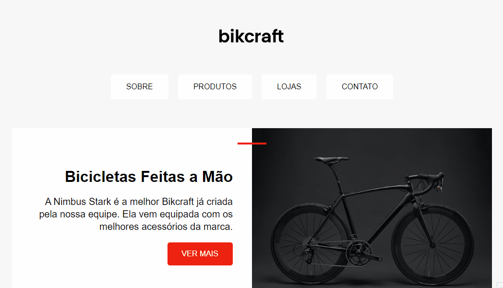

# Landing page - agência de bicicletas
Projeto sugerido através do curso HTML e CSS para Iniciantes-ORIGAMID

## Projeto
### 🔗 Acesse o <a href="https://keylalins.github.io/bikcraft-landing-page/" title="Acessar" target="_blank">site ativo.</a>

## Tecnologias
- `HTML5`
- `Propiedades CSS`

### Cores
---
- Destaques: #fff
- Fundo: #f7f7f7
- Texto destacado: #c6c6c6
- Detalhes: #ee2211

## Tipografia

Fonte: Arial

### Tamanhos
---
Conteúdo de tela: máximo 1000px

Textos: 1.6rem, 20rem, 3.2rem, 4.4rem
Responsivo: 2.5rem, 3rem

Espaçamento entre parágrafos: 1.3 
